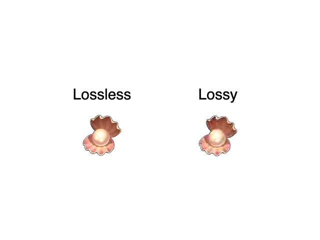
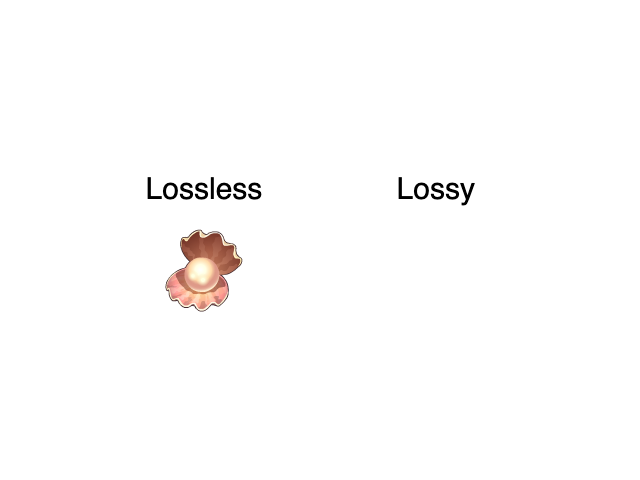

# lossy-bitmap

Investigation on lossy bitmap assets does not displaying using openfl 8.9.0

# build

You can build that project using haxelib distribution of openfl

    $ openfl build html5

# expected

That was working in previous 8.8.0 openfl release

# actual

As you can see lossy bitmap is missing

